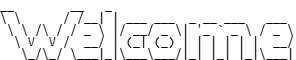

[](LICENSE)


[](Cargo.toml)
[](.github/workflows/init.yml)
[](https://python.org)

Hi there! I am Adam.

## 🧑‍💻 Source Code

You can grab the source code by running this command in Git:

```bash
git clone https://github.com/adamjohnson-gif/adamjohnson-gif.git
```
